# Step by Step: Social programming

Social(Team) programming Practice based on : bootProcessInformation

The Prototype Project : Real-time Monitoring System for Thermal Power Plant

## Software

* **Version control with Git:** Github.com, EGIT

* **Development:** Eclipse CDT,PyDev,Markdown Editor, Github Flavored Markdown Viewer

##  Steps

 * **One:**  Fork source bootProcessInformation to your gitHub account

 * **Two:**  Clone forkd bootProcessInformation to your local repository

 * **Three:** Import bootProcessInformation from local repository to Eclipse Workspace

 * **Four:**  Coding your task in the local project

 * **Five:**  Push to GitHub and contribute to the source repository

 * **Six:**  Merge your branch to the source branch

* **Seven:** Synchronize your branch with the source branch

**NOTE: you may 
     
   * use any software tools， for example：Github Desktop for Git client,  PyCharm for code, Atom for document   
   
   * clone source branch to **your local repository**,push and synchronize your local branch with the source branch

## Step One:  Fork source bootProcessInformation to your gitHub account

* Fork source bootProcessInformation

 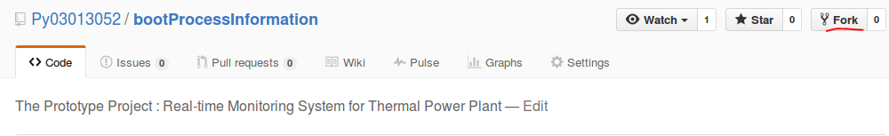

* Forked bootProcessInformation in your GitHub account

 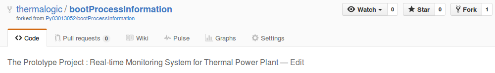

## Step Two:  Clone forked branch  to your local  respository

* Start clone: git

 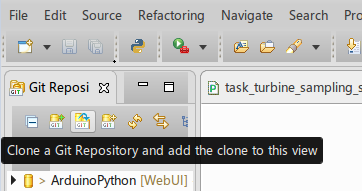

* copy url to clipboard

 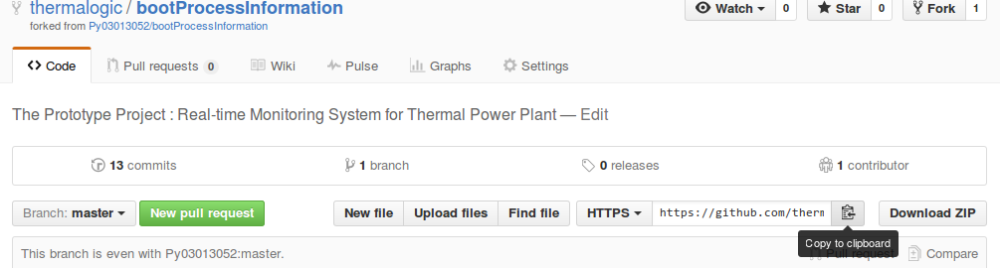

* copy source to your local

 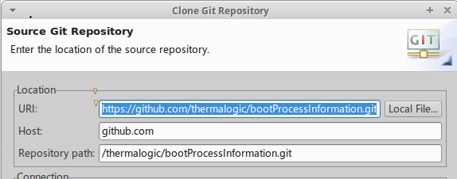

* Branch selection

 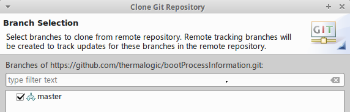

* cloned respository

 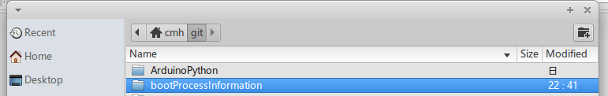

## Step Three: Import bootProcessInformation from local repository to Eclipse Workspace

* import project in the cloned respository to your workspace

  * File->import

  * general->Existing  Projects

  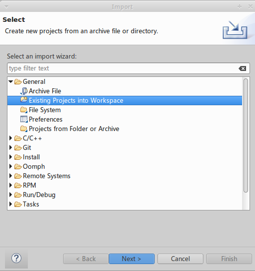

* choose your project

 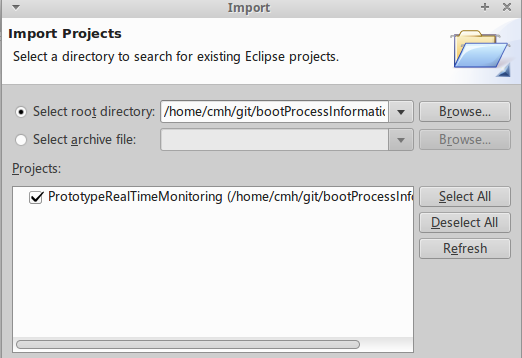

* imported project

 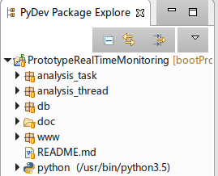

## Step Four: Coding your task in the local project

### 4.1 your analysis_task package

* new python package : m300exair

   * /PrototypeRealTimeMonitoring/analysis_task/m300exair

   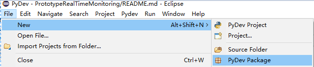

   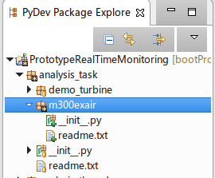

* copy all files of  ``analysis_task/demo_turbine``` to your m300exair , rename to

 ```
analysis_task
     |
     |--m300exair
         |
         |--readme.txt: your task introduction
         |
         |--__init__.py  :  package
         |
         |--pyexair.py : task analysis code
         |
         |--task_exair_tag_in.txt: input tag of your task (utf-8)
         |
         |--task_exair_tag_out.txt: input tag of your task (utf-8)
         |
         |--task_exair_sampling_simulation.py： sampling simulation on task_exair_tag_in.txt to redis
         |
         |--task_exair_online_analysis.py：

 ```

   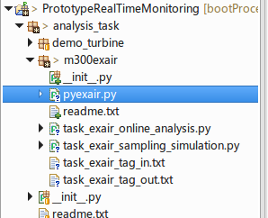


* then,coding:

#### 4.1.1 /analysis_task/__init__.py


```python
# TODO: add your package
from analysis_task.m300exair import *
```

####  4.1.2 pyexair.py

```python
def exaircoff(o2):
    return 21/(21-o2)
```

#### 4.1.3 tag about exair

* m300exair/task_exair_tag_in.txt

 ```
id	                       desc        	defaultvalue
DEMO.DCS2AI.2JZA2226	空预器进口烟气氧量	3.8375
```

* m300exair/task_exair_tag_out.txt

 ```
id                       	desc            defaultvalue
DEMO.DCS2AO.EXAIRCOFF  空预器进口过量空气系数     1.25
```
#### 4.1.4 exair_online_analysis

* m300exair/task_exair_online_analysis.py

 ```python
 from datetime import datetime
 import codecs

  from db.pyredis import TagDefToRedisHashKey, tagvalue_redis, SendToRedisHash
 from analysis_task.m300exair.pyexair import exaircoff

  class UnitExaircoff:

    def __init__(self, tagin, tagout):

        self.ailist = []
        file = codecs.open(tagin, 'r', 'utf-8')
        with file:
            discardline = file.readline()
            for line in  file:
                tagid, desc, value = line.split()
                self.ailist.append({'id':tagid})

        self.aolist = []
        file = codecs.open(tagout, 'r', 'utf-8')
        with file:
            discardline = file.readline()
            for line in  file:
                tagid, desc, value = line.split()
                self.aolist.append({'id':tagid, 'desc':desc, 'value':None, 'ts':None})

    def setouttag(self):
        TagDefToRedisHashKey(self.aolist)

    def Onlinecal(self):
        o2 = float(self.ailist[0]['value'])
        cur_exaircoff =exaircoff(o2)
        self.aolist[0]['value'] = cur_exaircoff

    def run(self):
        tagvalue_redis(self.ailist)
        self.Onlinecal()
        curtime = datetime.now()
        for tag in self.aolist:
            tag['ts'] = curtime

        SendToRedisHash(self.aolist)

        tagvalue_redis(self.aolist)

        for tag in self.aolist:
            print(tag['desc'], tag['value'])

 ```

#### 4.1.5 sampling simulation

* /m300exair/task_exair_sampling_simulation.py

 ```python
  class UnitExaircoffSimulation:

      def __init__(self, tagfile):

          self.ailist = []
        file = codecs.open(tagfile, 'r', 'utf-8')
        with file:
            discardline = file.readline()
            for line in  file:
                tagid, desc, value = line.split()
                self.ailist.append({'id':tagid, 'desc':desc, 'value':float(value)})

        self.o2base = self.ailist[0]['value']

      def settag(self):
          TagDefToRedisHashKey(self.ailist)

      def run(self):
          self.ailist[0]['value'] = self.o2base * (1 + random.random() * 0.005)

          curtime = datetime.now()
          for tag in self.ailist:
              tag['ts'] = curtime
          SendToRedisHash(self.ailist)

         print('UnitExaircoffSimulation sampling on ', self.ailist[0]['value'])

 ```

### 4.2 your analysis_task to analysis_thread

#### 4.2.1 /analysis_thread/sampling_simulation_thread_runner.py

* Add code

 ```python
 # TODO：add your module
from analysis_task.m300exair.task_exair_sampling_simulation import UnitExaircoffSimulation

    # add your task
    taginfile = os.path.join(analysis_taskpath, "m300exair", "task_exair_tag_in.txt")

    Simulation = UnitExaircoffSimulation(taginfile)
    TaskList.append(Simulation)    
 ```

* Test Running

  /m300exair/task_exair_sampling_simulation.py

  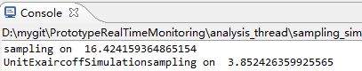

#### 4.2.2 analysis_thread/online_analysis_thread_runner.py

* Add code

 ```python
# add your module
from analysis_task.m300exair.task_exair_online_analysis import UnitExaircoff

     # TODO: add your task
    taginfile = os.path.join(analysis_taskpath, "m300exair", "task_exair_tag_in.txt")
    tagoutfile = os.path.join(analysis_taskpath, "m300exair", "task_exair_tag_out.txt")

    TaskExaircoff = UnitExaircoff(taginfile, tagoutfile)
    TaskList.append(TaskExaircoff)
  ```

* Test Running

  analysis_thread/online_analysis_thread_runner.py

  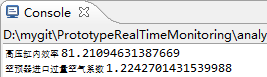


### 4.3 your page and handle to www

#### 4.3.1 page handler

* copy  demo files and rename to your task,then codeing

  * handler/m300exair_tag.txt

  ```
 desc	               id	               si
空预器进口烟气氧量	 DEMO.DCS2AI.2JZA2214   %
空预器进口过量空气系数	DEMO.DCS2AO.EXAIRCOFF	/
  ```

* handler/m300exair_handler.py

 ```python

  cur_tag=gentag("./handler/m300exair_tag.txt")

  class initHandler(tornado.web.RequestHandler):

        def get(self):

             title = '在线监视客户端： 过量空气系数'

            cur_tag.GetTagDefInfo()
            tagvalue = cur_tag.TagSnapshot(）
 ```

* modifing `www/__init__.py`

 ```python
   # TODO: add your handler
  from www.handler.m300exair_handler import *

 ```

#### 4.3.2 page template

* copy demo  template and rename for your task


* then modifying ```/templates/m300exair_ui.html``` contents

 ```javascript
 // TODO: your   websocket URL
 ws = new WebSocket("ws://" + window.location.host + "/m300exair_websocket");
 ```

#### 4.3.3 add your page template to web site

* /www/app.py

 ```python
   # TODO: import you handler
   import www.handler.m300exair_handler as m300exair

    def sendmsssage2allclient():

          # TODO: add your  task
          m300exair.cur_tag.sendmsssage2client()

   class Application(tornado.web.Application):   

         def __init__(self):
             handlers = [
                  (r"/", indexHandler),

                   # TODO: add your handler
                   (r"/m300exair/", m300exair.initHandler),
                   (r"/m300exair_websocket",m300exair.WebSocketHandler),
              ]  
```

* templates/index.html

 ```javascript
   <div class="container">
        <h3 class="offset3">分析任务 </h1>

        <ul class="pull-center">
	      <li><a href="/demo_tb/">示例：高压缸效率</a></li>

          <!-- add your link  -->
          <li><a href="/m300exair/">m300exair:过量空气系数</a></li>

        </ul>
  </div>
 ```

#### 4.3.4 Running

`/www/app.py`

* Home Page

  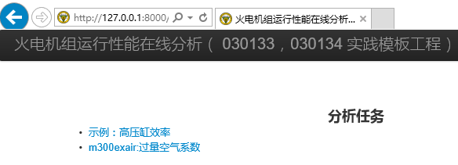

* your task page

  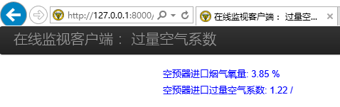

### 4.4 review your code

* **TODO** comment tag in your coding location,

   "Windows->Show View->Tasks" to review your code

    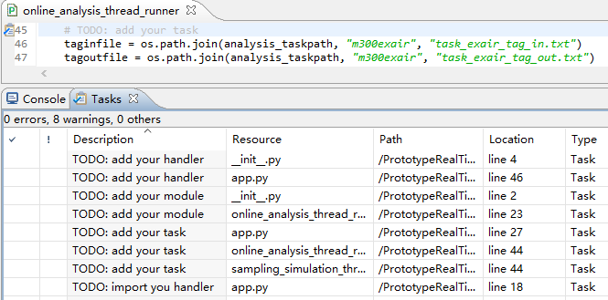

## Step Five:  Push to GitHub and contribute to the source repository

### 5.1 Commit and push local to your fored repository on github

* Commit

  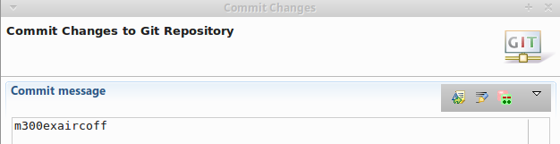

  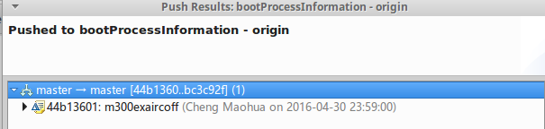

* check result on github

 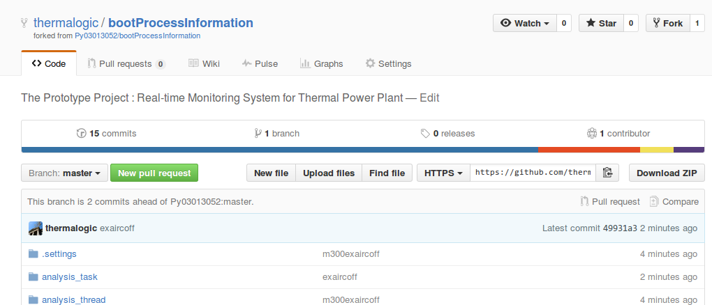

### 5.2 Contribute to the source repository

* New pull requests to source repository

 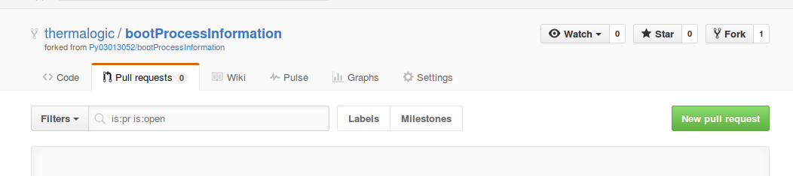

* Create  pull request

   * source repository in the left , your repository in the right

   * request pull your repository (right) to source repository(left)

   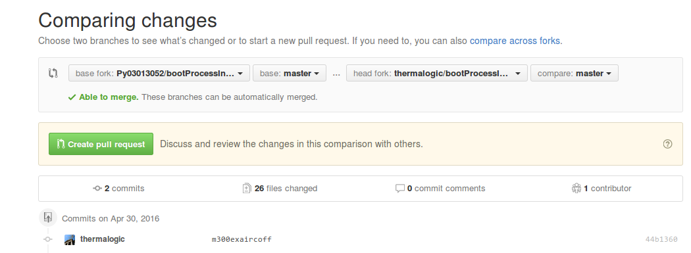

* commit message

   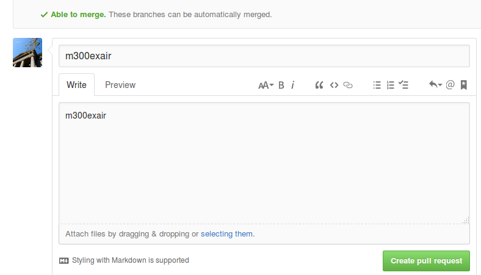

## Step Six:  Merge your branch to the source branch

### 6.1 source: remote merge

* check pull requests:

  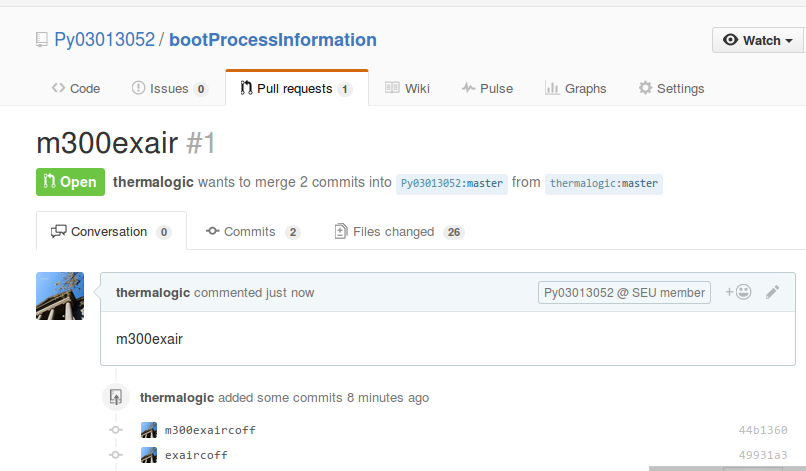

* merge pull requests:

  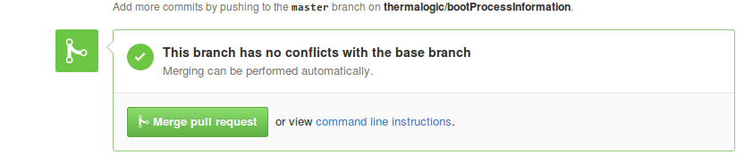

  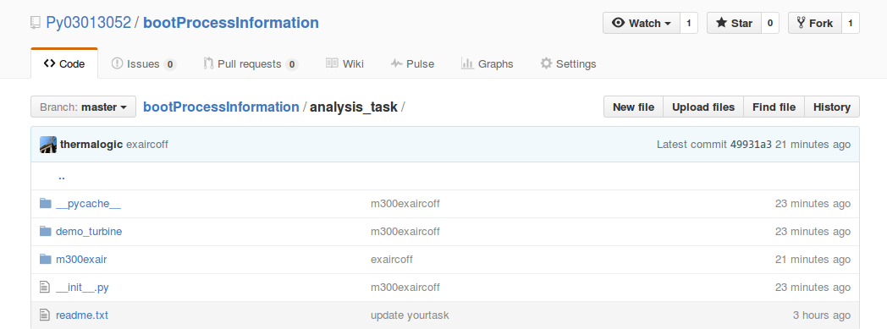

### 6.2 source: pull remote  to  local

* pull remote  to  local

   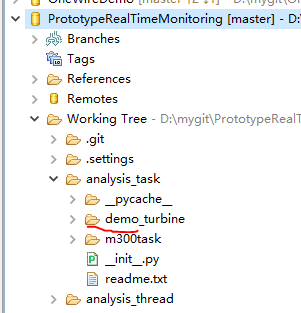

   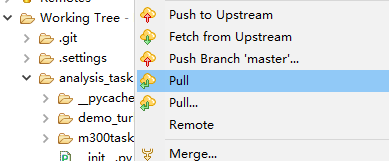

   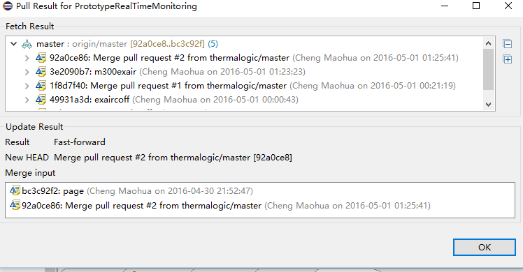

* local after pull

  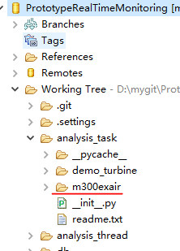

## Step Seven:  synchronize your branch with the source branch

* the source branch appended guide after your forked, synchronous action:

### 7.1 new pull request in your forked branch

* "New pull request"

  

* after "New pull request"
   * base fork(left): the source branch

   * head fork(right): your forked branch：(yellow)

 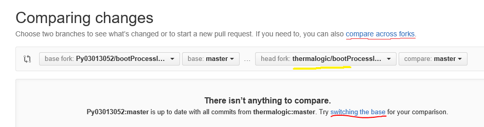


* you need  **compare across forks** or **switching  the  base**

 change  base fork and head fork, so that:

   * **base fork(left)**: your forked branch：(yellow)

   *  head fork(right): the source branch:  

   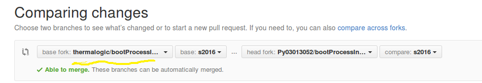

* then, you can “Create pull request”:

   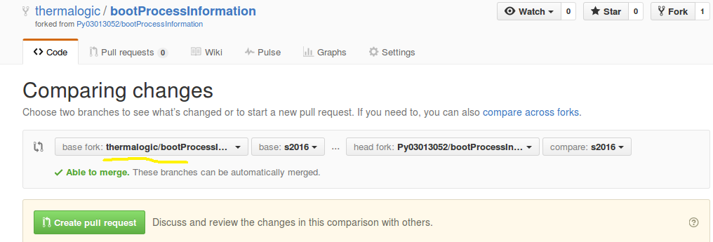

* you see all commits in source branch after you forked

   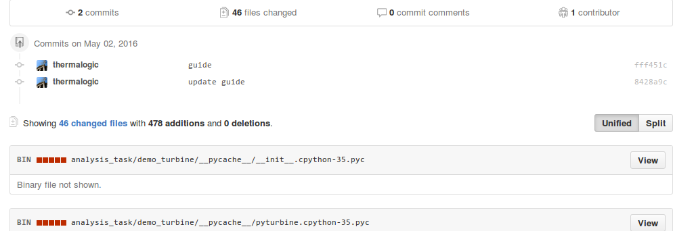

* pull request +1 :

  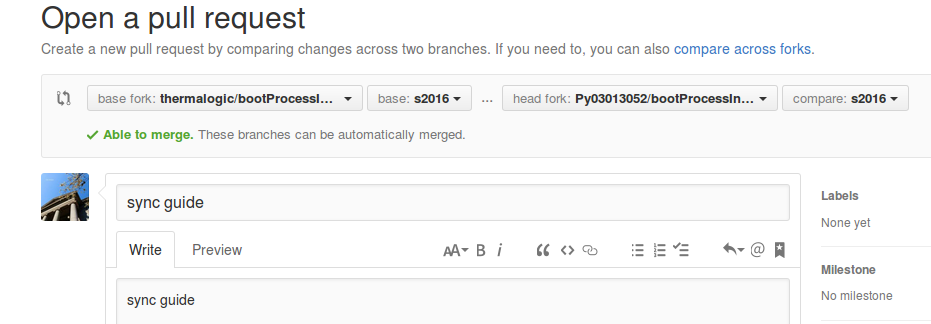

  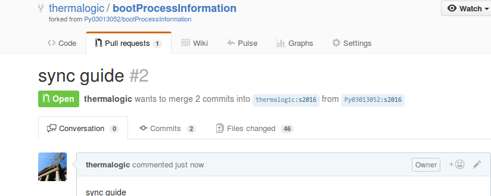

### 7.2 merge pull request(source branch to your branch)

* merge source branch to your branch

 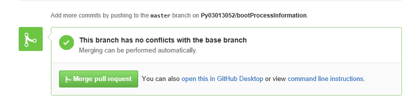

* synchronized branch

 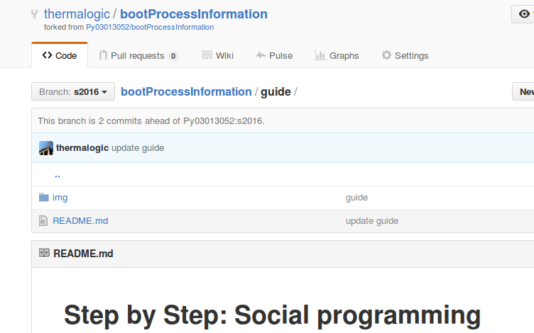
